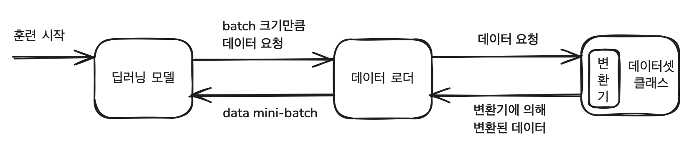
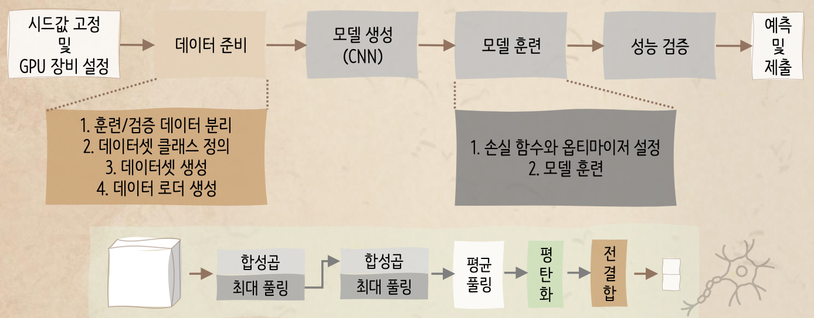
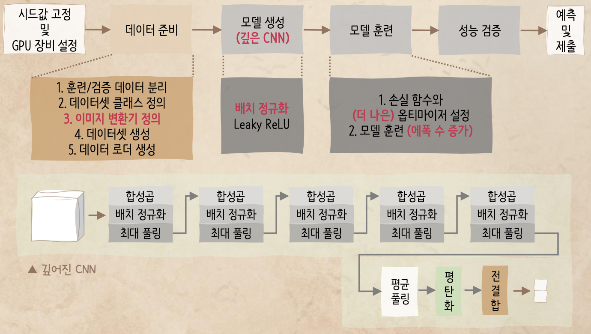

# Aerial Cactus Identification 

- Competition Link
    - https://www.kaggle.com/c/aerial-cactus-identification/overview

- Tutorial Link
    - 탐색적 데이터 분석 : https://www.kaggle.com/werooring/ch11-eda
    - 베이스라인 모델 : https://www.kaggle.com/werooring/ch11-baseline
    - 성능 개선 : https://www.kaggle.com/werooring/ch11-modeling
    - 한 걸음 더 : https://www.kaggle.com/werooring/ch11-modeling2

- My Work
    - [https://www.kaggle.com/code/trispark/aerial-cactus-identification-eda](https://www.kaggle.com/code/trispark/aerial-cactus-identification-eda/edit)
    - [https://www.kaggle.com/code/trispark/aerial-cactus-identification-baseline](https://www.kaggle.com/code/trispark/aerial-cactus-identification-baseline/notebook)
    

### Contents
- **Goal**
- **Convolutional Neural Network**
    - My summary
- **Baseline Model**
    - Preparing Data
    - Create CNN Model
    - Train Model
    - Model Evaluation
    - Prediction
- **Performance Improvement**
    - Performance Improvement
    - Improved CNN Model
- **Performance Improvement 2**
- **Evaluation**
    - ROC AUC
        

### 1. Goal

- Creation of an algorithm that can identify a specific type of cactus in aerial imagery

### 2. Convolutional Neural Network

- Reference link: https://www.youtube.com/watch?v=HGwBXDKFk9I
- My summary
    
    [MLB.pdf](./src/MLB.pdf)
    

### 3. Baseline Model

- Preparing Data
    1. Divide train / validation data
        - **stratify**
            - Stratify refers to the process of ensuring that each class or category in a dataset is proportionally represented when splitting the data
            - ex) stratify = labels['has_cactus'] in next cell -> target value ratio was 1 : 3 -> this ratio is also applied in each train / validation data
            
            ```python
            train, valid = train_test_split(labels, 
                                           test_size = 0.1, # ratio; train : valid = 9 : 1
                                           stratify = labels['has_cactus'],
                                           random_state = 50)
            ```
            
    2. Define DataSet class
        - Use Dataset class provided by `pytorch`
        - Have to overide `__len__()` and `__getitem()__`
            - `__len__()`: return Dataset's size
            - `__getitem()__`: return data of corresponding index
    3. Create DataSet
    4. Create Data Loader
    - What is DataSet class & DataLoader's job?
        - Provide data in mini-batch unit which is needed for deep learning model's training
        - Data Loader:  Fetch data by designated batch size
            
            
            
        
- Create CNN Model
    
    
    
- Train Model
    - Loss Function: use `cross entropy` (it’s common for classification problem)
    - Optimizer: finding optimized weight algorithm
        - `SGD` : standard optimizer (use stochastic gradient descent)
    - Process of Deep Learning Model Traning for images
        1. Fetch data of batch size from data loader
        2. Allocate given image and label(target) data to device(GPU)
        3. Initialize gradient of Optimizer
        4. Give input data (img) to CNN model -> forward propagation -> get output (predicted value)
        5. Compare predicted value and label (target) value to calculate loss
        6. Perform back propagation based on loss
        7. Update weight using gradient calculated by back prop
        8. Repeat 1~7 * (repeat count)
        9. Repeat 1~8 * (epoch count)
        
- Model Evaluation
    
    ```python
    model.eval() # evaluation stage -> won't apply dropout 
    
    with torch.no_grad(): # inactivate calculating gradient (no need to calculate gradient in evaluation step)
        for images, labels in loader_valid:
            images = images.to(device)
            labels = labels.to(device)
            
            outputs = model(images)
            # why back to cpu? -> roc_auc is sklearn -> it can't perform on GPU
            preds = torch.softmax(outputs.cpu(), dim = 1)[:, 1] # preds probability
            true = labels.cpu() # true val
            
            # have to convert preds and true tensors to original python array or numpy array
            preds_list.extend(preds.numpy())
            true_list.extend(true.numpy())
            
    print(f'validation data ROC AUC: {roc_auc_score(true_list, preds_list):.4f}')
    ```
    
- Prediction
    - Similar process with Model Evaluation
    - No need to loop over `labels`

### 4. Performance Improvement

- Performance Improvement
    - Perform various image transformation -> define image transformer
        - To create more image data -> Data augmentation (데이터 증강)
    - Create deeper CNN
    - Use better optimizer -> instead of standard one
        - Use `Adamax` (better ver of Adam)
        
        ```python
        optimizer = torch.optim.Adamax(model.parameters(), lr = 0.00006)
        ```
        
    - Increase epoch number: 10 → 70

- Improved CNN model
    - Deeper CNN
    - Apply batch normalization
        - Goal: Stabilize training, Faster convergence
        - For each mini-batch, batch normalization computes the mean and variance of the inputs and normalizes them
        - After normalization, batch normalization introduces two trainable parameters, \gamma (scale) and \beta (shift), to allow the network to restore the representational capacity if needed
    - Use Leaky ReLU for activation function
    
    
    

### 5. Performance Improvement 2

- In prev Modeling, we divided train/validation data in ratio 9 : 1
- Instead, use whole training data to train the model
    
    ```python
    # divide train / validation Data
    _, valid = train_test_split(labels,
                             test_size = 0.1, # ratio; _ : valid = 9 : 1
                             stratify = labels['has_cactus'],
                             random_state = 50)
    ```
    
    ```python
    # create train / validation dataset
    dataset_train = ImageDataset(df = labels, img_dir = 'train/', transform = transform_train)
    dataset_valid = ImageDataset(df = valid, img_dir = 'train/', transform = transform_test)
    ```
    

### 6. Evaluation
- ROC & AUC
    - Reference link: https://www.youtube.com/watch?v=4jRBRDbJemM
    - ROC: Receiver Operating Characteristic Curve
        - **Y-Axis (TPR or Recall)**: Represents the proportion of actual positives that are correctly predicted. (TPR: True Positive Rate)
            
            $$
            
            \text{TPR} = \frac{\text{True Positives (TP)}}{\text{True Positives (TP)} + \text{False Negatives (FN)}}
            $$
            
        - **X-Axis (FPR)**: Represents the proportion of actual negatives that are incorrectly predicted as positives. (FPR: False Positive Rate)
        
        $$
        
        \text{FPR} = \frac{\text{False Positives (FP)}}{\text{False Positives (FP)} + \text{True Negatives (TN)}}
        $$
        
        - **The curve**: The ROC curve shows the trade-off between the true positive rate and the false positive rate as you vary the classification threshold. The closer the curve is to the top-left corner, the better the model’s performance.
    - AUC: Area Under the ROC Curve
        
        
        
        Area under ROC curve
        
- Submissions are evaluated on [area under the ROC curve](http://en.wikipedia.org/wiki/Receiver_operating_characteristic) between the predicted probability and the observed target.