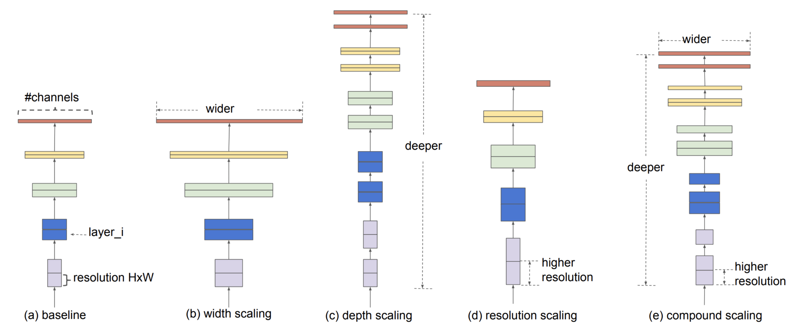
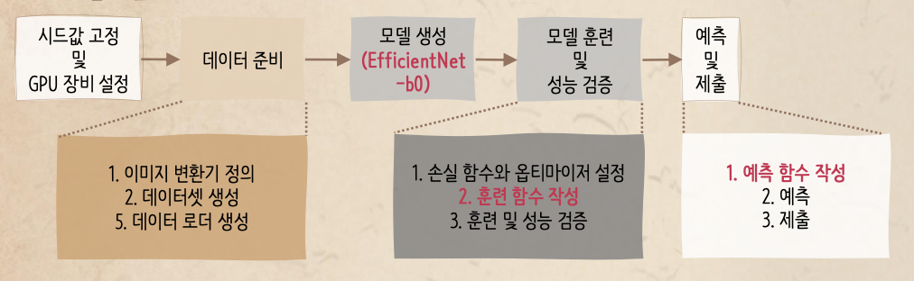
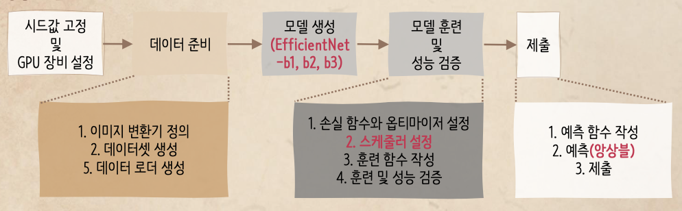

- Dataset Link
    - https://www.kaggle.com/datasets/paultimothymooney/chest-xray-pneumonia

- Tutorial Link
    - 탐색적 데이터 분석 : https://www.kaggle.com/werooring/ch13-eda
    - 베이스라인 모델 : https://www.kaggle.com/werooring/ch13-baseline
    - 성능 개선 : https://www.kaggle.com/werooring/ch13-modeling

- Contents
    - **Goal**
    - **Efficient-Net**
    - **Baseline Model**
        - Process
        1. Data Preping
        2. Create Model
        3. Train Model / Validate Performance
        4. Prediction / Test Result
    - **Performance Improvement**
        - Process
        - Ensemble
    - **Evaluation**
        - Accuracy, Recall, and F1 score

### Goal

- Decide whether people are normal / pneumonia based on chest x-ray images
- Binary Classification problem

### Efficient-Net

- EfficientNet is a family of convolutional neural networks (CNNs) designed for image classification tasks, introduced by Google AI in 2019
- Its architecture was created with the aim of achieving high accuracy while being more computationally efficient compared to traditional CNN models
- **Compound Scaling**
    - Traditionally, models are scaled by increasing the depth (number of layers), width (number of channels), or input resolution, but not all at the same time
    - EfficientNet scales these three dimensions simultaneously and in a balanced way
        
        
        
- Better trade-off between accuracy and computational cost (FLOPs) than other state-of-the-art models
    - Requires fewer parameters and computations to achieve the same or better accuracy than models like ResNet, for example
    - FLOPs: Floating Point Operations per Second
- **Versions**
    - **B0**: The baseline model. It is the smallest and fastest but with the least accuracy
    - **B1**: Increases the input resolution slightly and adds depth, leading to better performance at the cost of higher computational power
    - **B2**: Further increases the input resolution and width for improved accuracy
    - **B3**: The largest of the first four, with significantly higher resolution and depth, providing better accuracy but also requiring more computational resources
    - **B4** to **B7**: Larger networks with progressively higher input resolutions, increasing both depth and width to handle more complex tasks with better accuracy
    - **B8**: Further increases in both input resolution and model size for very high accuracy but comes at the cost of requiring substantial computational resources
    - **L2**: The largest model in the EfficientNet family, designed for ultra-high precision but with extreme computational demands
    

### Baseline Model

- Process
    
    
    
    - Data Augmentation: apply various transformers
    - Model: pre-trained model (`efficientnet-b0`)
    - Optimizer: `Adam`
    - training / prediction: bind training and predict stage together and make as a method→ reuse in performance improvement stage

1. Data Preping
    1. Skip dividing train / validation data → already divided
    2. Skip defining dataset class → can use `ImageFolder` dataset generator instead in step 4
    3. Define image transformer for data augmentation
        - Use `torchvision`'s `transforms` (it’s required by `imageFolder`)
        - Define image transformer for train / test data respectively → make the image size same
    4. Create dataset / data loader
        - dataset
            - `ImageFolder` class: when target value is divided by directory, can use this class to make dataset directly
        - data loader
            - try different batch size value to enhance performance

1. Create Model 

1. Train Model / Validate Performance
    1. Set loss function / optimizer
        - Use `CrossEntropyLoss()` (loss function for classification problem)
        - `Adam`
    - Define training method
        
        ```python
        def train(model, loader_train, loader_valid, criterion, optimizer, scheduler=None, epochs=10, save_file='model_state_dict.pth'):
        	# repeat for every epoch
        	for epoch in range(epochs):
        		# == [training] ==================================================
        		# train in mini-batch unit
        		for images, labels in tqdm(loader_train):
        			# initialize gradient
        			# forward propagation
        			# calculate loss value (for train data)
        			# back propagation
        			# update weight
        			# update learning rate
        			
        		# == [validation] ================================================
        		# validate in mini-batch unit
        		for images, labels in loader_valid:
        			# forward propagation
        			# calcuate lossvalue (for validation data)
        			
        		# == [find optimized model weight] =====================================
        		# if loss value of validation data is the smallest in current epoch,
        			# store current epoch's model weight (which is optimized model weight so far)
        			
        	return torch.load(save_file) #return optimized model weight
        ```
        
    - Actual Code
            
        ```python
        from sklearn.metrics import accuracy_score # Accuracy calculation
        from sklearn.metrics import recall_score   # Recall calculation
        from sklearn.metrics import f1_score       # F1 score calculation
        from tqdm.notebook import tqdm             # progress bar
        
        def train(model, loader_train, loader_valid, criterion, optimizer, 
                    scheduler=None, epochs=10, save_file='model_state_dict.pth'):
            
            valid_loss_min = np.inf # initialize minimum loss value (for validation data)
        
            # repeat for every epoch
            for epoch in range(epochs):
                print(f'에폭 [{epoch+1}/{epochs}] \n-----------------------------')
                
                # == [training] ==================================================
                model.train()        # set model to 'train' status
                epoch_train_loss = 0 # initialize loss value per epoch (for train data)
                # repeat for #repeat
                for images, labels in tqdm(loader_train):
                    # allocate imgage, label data mini-batch to device
                    images = images.to(device)
                    labels = labels.to(device)
                    
                    # initialize gradient of optimizer
                    optimizer.zero_grad()
                    # forward prop: calcuate output using image data as model's input
                    outputs = model(images)
                    # calculate loss value of outputs and labels using loss function
                    loss = criterion(outputs, labels)
                    # update (add) loss of current batch (for train data)
                    epoch_train_loss += loss.item() 
                    loss.backward()       # perform back prop
                    optimizer.step()      # update weight
                    if scheduler != None: # update scheduler's learning rate
                        scheduler.step() 
        
                # print train data's loss val
                print(f'\t훈련 데이터 손실값 : {epoch_train_loss/len(loader_train):.4f}')
                
                # == [validation] ================================================
                model.eval()         # set model to `validation` status
                epoch_valid_loss = 0 # initialize loss value per epoch (for validation data)
                preds_list = []      # initialize list for storing predictions
                true_list = []       # initialize list for storing acutal values
                
                with torch.no_grad(): # inactivate gradient calculation
                    for images, labels in loader_valid:
                        images = images.to(device)
                        labels = labels.to(device)
                        
                        outputs = model(images)
                        loss = criterion(outputs, labels)
                        epoch_valid_loss += loss.item()
                        
                        # preds and actual values
                        preds = torch.max(outputs.cpu(), dim=1)[1].numpy() 
                        true = labels.cpu().numpy() 
            
                        preds_list.extend(preds)
                        true_list.extend(true)
                        
                # calculate accuracy, recall, and F1 score
                val_accuracy = accuracy_score(true_list, preds_list)
                val_recall = recall_score(true_list, preds_list)
                val_f1_score = f1_score(true_list, preds_list)
        
                # print accuracy, recall, and F1 score of validation data
                print(f'\t검증 데이터 손실값 : {epoch_valid_loss/len(loader_valid):.4f}')
                print(f'\t정확도 : {val_accuracy:.4f} / 재현율 : {val_recall:.4f} / F1 점수 : {val_f1_score:.4f}')
                # == [find optimized model weight] =====================================
                # if loss value of validation data is the smallest in current epoch,
                        # store current epoch's model weight (which is optimized model weight so far)
                if epoch_valid_loss <= valid_loss_min: 
                    print(f'\t### 검증 데이터 손실값 감소 ({valid_loss_min:.4f} --> {epoch_valid_loss:.4f}). 모델 저장')
                    # store model weight in file
                    torch.save(model.state_dict(), save_file) 
                    valid_loss_min = epoch_valid_loss # update minimum loss value
            return torch.load(save_file) # return stored model weight
        ```
            
        
2. Prediction / Test Result
    1. Create test dataset / data loader
    2. Define predict method 
        
        ```python
        def predict(model, loader_test, return_true=False):
            model.eval()    # set model to test status
            preds_list = [] # initialize list for storing predictions
            true_list = []  # initialize list for storing acutal values
        
            with torch.no_grad(): # inactivate gradient calculation
                for images, labels in loader_test:
                    images = images.to(device)
                    labels = labels.to(device)
                    
                    outputs = model(images)
                    
                    preds = torch.max(outputs.cpu(), dim=1)[1].numpy() # pred val
                    true = labels.cpu().numpy() # actual val
        
                    preds_list.extend(preds)
                    true_list.extend(true)
        
            if return_true:
                return true_list, preds_list
            else:
                return preds_list
        ```
        

### Performance Improvement

- Process
    
    
    
    - Data Augmentation: same with baseline model
    - Model: `efficientnet-b1`, `efficientnet-b2`, `efficientnet-b3` → Ensemble
    - Optimizer: `AdamW`
    - training / prediction: use method from baseline model

- Ensemble
    - principle of majority
    
    ```python
    ensemble_preds = []
    
    for i in range(len(preds_list1)):
        pred_element = np.round((preds_list1[i] + preds_list2[i] + preds_list3[i])/3)
        ensemble_preds.append(pred_element)
    ```
    

### Evaluation

- Accuracy, Recall, and F1 score
    - Have to predict in discrete value, not probability rate → use 1(positive), 0(negative)