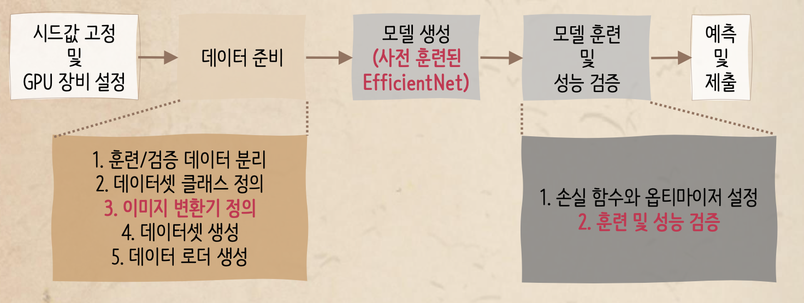
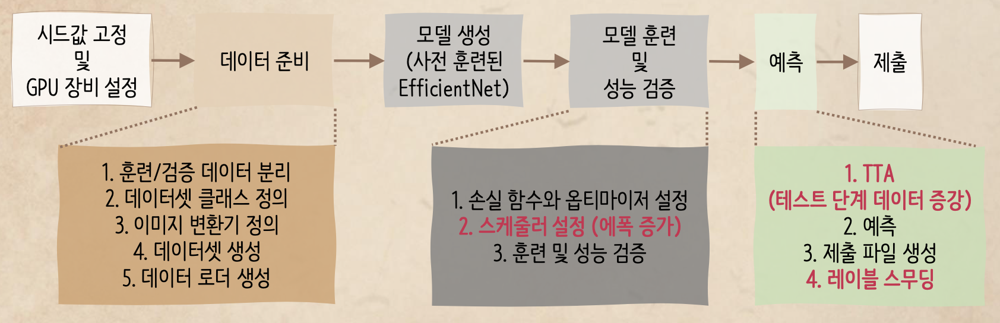
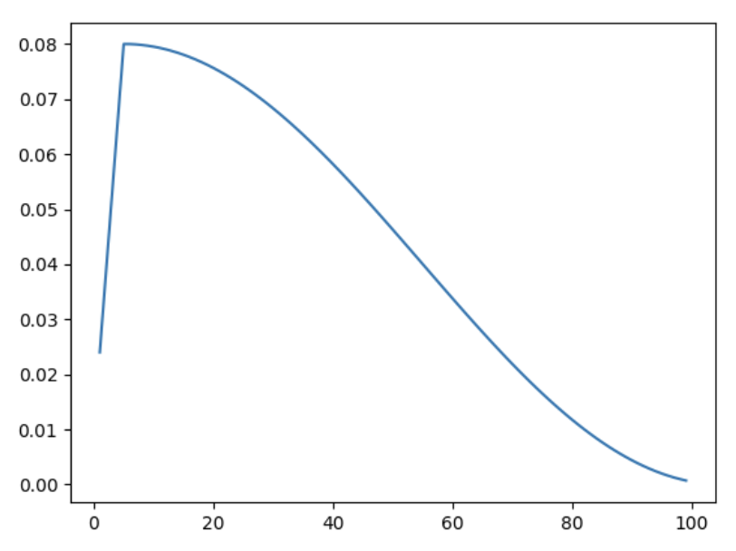
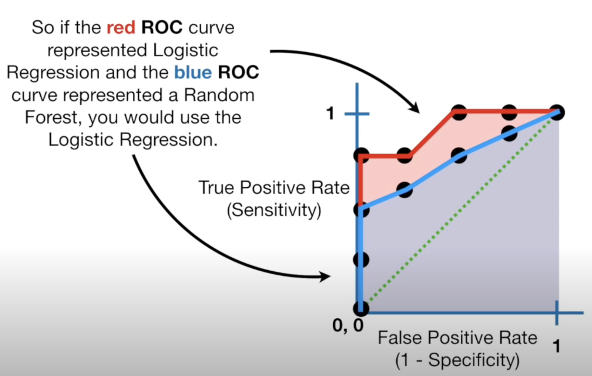

# Plant Pathology

- Competition Link
    - https://www.kaggle.com/c/plant-pathology-2020-fgvc7/data

- Tutorial Link
    - 탐색적 데이터 분석 : https://www.kaggle.com/werooring/ch12-eda
    - 베이스라인 모델 : https://www.kaggle.com/werooring/ch12-baseline
    - 성능 개선 : https://www.kaggle.com/werooring/ch12-modeling
    - 한 걸음 더 : https://www.kaggle.com/werooring/ch12-modeling2

- Contents
    - **Goal**
    - **Baseline Model**
        - Process
        - Define image transformer
        - Use multi-processing
        - Choosing Model: Pre-trained Model → Transfer Learning
        - EfficientNet
        - Training Model
    - **Performance Improvement**
        - Process
        - Increase Epoch
        - Set Scheduler
        - TTA
        - Label Smoothing
    - **Performance Improvement 2**
        - Use entire training data
    - **Evaluation**
        - ROC & AUC
        
    
    ### Goal
    
     - Train a model using images of training dataset to 
    
    1. Accurately classify a given image from testing dataset into different diseased category or a healthy leaf
    2.  Accurately distinguish between many diseases, sometimes more than one on a single leaf
    3. Deal with rare classes and novel symptoms
    4. Address depth perception—angle, light, shade, physiological age of the leaf
    5. Incorporate expert knowledge in identification, annotation, quantification, and guiding computer vision to search for relevant features during learning

### Baseline Model

- Process
    
    
    
- Define image transformer
    - Use `albumentations` module’s transformer
    - Faster & provide various image transformation than `torchvision` module’s one
    - Still, since `pytorch` only treats `Tensor` object, use `ToTensorV2()` transformer
    
- Use multi-processing (it takes long time to train the model)
    - Define `seed_worker()` and create `Generator`
    
- Choosing Model: Pre-trained Model → Transfer Learning
    - Using pretrained model with `pytorch`
        - Use `torchvision.models` module
        - Use `pretrainedmodels` module
        - Use self-constructed / searched module -> **EfficientNet**
    - Perform transfer learning
        - Transfer learning: re-training pretrained model on similar but difference area

- EfficientNet
    - EfficientNet is a family of convolutional neural networks (CNNs) designed for image classification tasks, introduced by Google AI in 2019
    - Its architecture was created with the aim of achieving high accuracy while being more computationally efficient compared to traditional CNN models
    - **Compound Scaling**
        - Traditionally, models are scaled by increasing the depth (number of layers), width (number of channels), or input resolution, but not all at the same time
        - EfficientNet scales these three dimensions simultaneously and in a balanced way
            
            
            
    - Better trade-off between accuracy and computational cost (FLOPs) than other state-of-the-art models
        - Requires fewer parameters and computations to achieve the same or better accuracy than models like ResNet, for example

- Training Model
    - Performance Validation
        - Instead of validating after perform training all epochs, validate after **every** epoch
        - It takes longer time, but it can check there's no overfitting while training
    - Process
        
        ```python
        # Process of training and validation
        
        for epoch in range(epochs):
            # == [ train ] ==============================================
            # set model to training status
            # initialize loss value per each epoch
            
            for images, labels in tqdm(loader_train):
                # initialize gradient
                # forward propagation
                # calculate loss value (for train data)
                # back propagation
                # update weight
                
            # == [ validation ] ==============================================
            # set model to testing sattus
            with torch.no_grad(): # inactivate gradient calculation
                # validate in mini-batch unit
                for images, labels in loader_valid:
                    # forward propagation
                    # calcuate loss value (for validation data)
                    # calculate predicted and actual value
                    
            # print validation data's loss value and ROC AUC score
                
        ```
        

### Performance Improvement

- Process
    
    
    

- Increase Epoch
    - 5 → 39
    - If it’s too small → underfitting / too big → overfitting

- Set Scheduler
    - Provide functionality to adjust learning rate when training
        - Early stage: prefer big learning rate (to update weight faster)
        - Ongoing: slowly decrease learning rate (better way to find optimized weight)
    - Use `get_cosine_schedule_with_warmup()` scheduler
        - Step 1. Increase learning rate until it reaches lr designated by optimizer
        - Step 2. Decreate lr in cosine graph shape
            
            
            
    - By this scheduler, lr is updated after each training iteration
    
    ```python
    scheduler = get_cosine_schedule_with_warmup(optimizer, 
    																						num_warmup_steps=len(loader_train)*3,
    																						num_training_steps=len(loader_train)*epochs)
    ```
    
    - `num_warmup_steps=len(loader_train)*3`
        - # iterations per epoch: `len(loader_train)`
        - Reach designated lr in 3 epochs
    - Have to update scheduler lr in every iteration `scheduler.step()`

- Test-Time Augmentation (TTA)
    1. Apply various transformation on test data
    2. Predict target probability per transformed test data
    3. Get mean of all target prediction rate → final submission value

- Label Smoothing
    - Revise overconfidence prediction value to generalization performance
    
    $$
    (1 - \alpha) * preds + \alpha / K
    $$
    
    - Smoothing Parameter (alpha): big alpha → strong smoothing
    - K: target value count
    
    ```python
    def apply_label_smoothing(df, target, alpha, threshold):
    	# copy target value
    	df_target = df[target].copy()
    	k = len(target)
    	
    	for idx, row in df_target.iterrows():
    		# if it's over the threshold
    		# consider as overconfident prediction 
    		if (row > threshold).any(): 
    			row = (1 - alpha) * row + alpha / k
    			df_target.iloc[idx] = row # substitute val
    			
    	return df_target
    ```
    

### Performance Improvement 2

- Use entire training data to train the model

### Evaluation

- Submissions are evaluated on mean column-wise ROC AUC. In other words, the score is the average of the individual AUCs of each predicted column.
- ROC & AUC
    - Reference link: https://www.youtube.com/watch?v=4jRBRDbJemM
    - ROC: Receiver Operating Characteristic Curve
        - **Y-Axis (TPR or Recall)**: Represents the proportion of actual positives that are correctly predicted. (TPR: True Positive Rate)
            
            $$
            
            \text{TPR} = \frac{\text{True Positives (TP)}}{\text{True Positives (TP)} + \text{False Negatives (FN)}}
            $$
            
        - **X-Axis (FPR)**: Represents the proportion of actual negatives that are incorrectly predicted as positives. (FPR: False Positive Rate)
        
        $$
        
        \text{FPR} = \frac{\text{False Positives (FP)}}{\text{False Positives (FP)} + \text{True Negatives (TN)}}
        $$
        
        - **The curve**: The ROC curve shows the trade-off between the true positive rate and the false positive rate as you vary the classification threshold. The closer the curve is to the top-left corner, the better the model’s performance.
    - AUC: Area Under the ROC Curve
        
        
        
        Area under ROC curve
