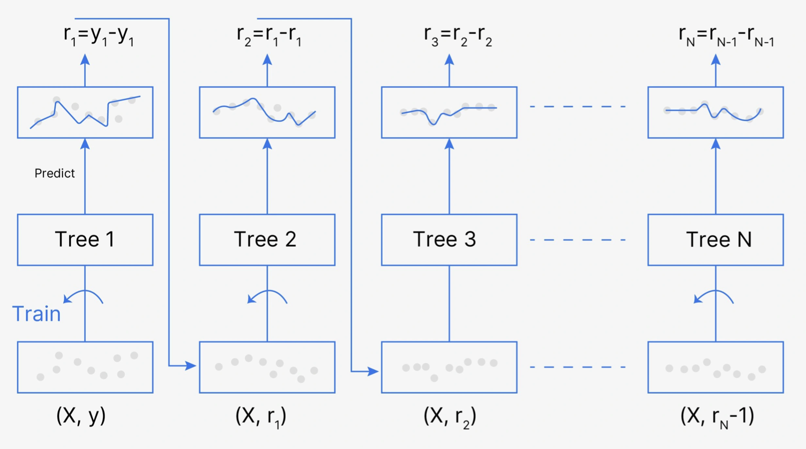

# Predict Future Sales 

- Tutorial Link
    - 탐색적 데이터 분석 : https://www.kaggle.com/werooring/ch9-eda
    - 베이스라인 모델 : https://www.kaggle.com/werooring/ch9-baseline
    - 성능 개선 : https://www.kaggle.com/werooring/ch9-modeling

- My Work
    - https://www.kaggle.com/code/trispark/predict-future-sales-eda
    - https://www.kaggle.com/code/trispark/predict-future-sales-baseline
    - https://www.kaggle.com/code/trispark/predict-future-sales-modeling

- Contents
    - **Goal**
    - **Feature Engineering**
        - For Baseline Model
        - For Performance Improvement
        - Garbage Collection
    - **Training Model**
        - LightGBM
    - **Evaluation**
        - RMSE

### Goal

- Predict total sales for every product and store in the next month

### Feature Engineering

- In BaseLine Model
    1. Convert feature name in Korean → for readability
    2. Data downcasting 
        - Process of converting a data type to a more memory-efficient (smaller or more specific) type in order to save memory without losing important information
        - Typically done on numerical data types, such as integers and floats, where larger data types (like int64 or float64) can be converted into smaller types (like int32, float32, or even int16/int8), as long as the values fit within the range of the smaller type
        
        ```python
        def downcast(df, verbose=True):
            start_mem = df.memory_usage().sum() / 1024**2 # calculate start mem usage, change Byte -> Mega Byte by 1024**2
            for col in df.columns:
                dtype_name = df[col].dtype.name
                if dtype_name == 'object':
                    pass
                elif dtype_name == 'bool':
                    df[col] = df[col].astype('int8')
                elif dtype_name.startswith('int') or (df[col].round() == df[col]).all():
                    df[col] = pd.to_numeric(df[col], downcast='integer')
                else:
                    df[col] = pd.to_numeric(df[col], downcast='float')
            end_mem = df.memory_usage().sum() / 1024**2 # calculate end mem usage
            if verbose: # if verbose = True -> print detailed info
                print('{:.1f}% compressed'.format(100 * (start_mem - end_mem) / start_mem))
            
            return df
        ```
        
        - `bool` type → `int8` type (`True`: 1, `False`: 0)
        - Downcast to smaller `integer` type (automatically done by `downcast = integer` flag
        - Downcast to smaller `float` type
        - No chance to `object` type
    3. Create data combination
        - To make more meaningful rows
        - Make combination of `all_shop` * `all_item`
        
        ```python
        from itertools import product
        
        train = []
        # 월ID, 상점ID, 상품ID -> create combination 
        for i in sales_train['월ID'].unique():
            all_shop = sales_train.loc[sales_train['월ID']==i, '상점ID'].unique()
            all_item = sales_train.loc[sales_train['월ID']==i, '상품ID'].unique()
            train.append(np.array(list(product([i], all_shop, all_item))))
        
        idx_features = ['월ID', '상점ID', '상품ID'] #
        # transform list type train data to DataFrame type
        train = pd.DataFrame(np.vstack(train), columns=idx_features)
        ```
        
    4. Add target value 
        - Target value: monthly sales
        - How to get `월간 판매량`?
            - Group by [`월ID`, `상점ID`, `상품ID` ] → add up `판매량`
    5. Concat test data
    6. Merge all data
        - Create train / validation / test data set
- For Performance Improvement
    1. Convert feature name to Korean + Data downcasting
    2. Feature engineering each data feature
    3. Create data combination + create derived features 
    4. Concat test data + merge all data 
    5. Create **time lag feature**
        - Helps improving **time series problem**
        - Involves taking past values from a time series and using them as features to predict future values
        - This is a common practice in time series analysis to capture dependencies between past and future observations
        - Steps
            1. **Identify the time series column**: The main column that you want to create lag features for, usually a numeric value like sales, stock price, or temperature.
            2. **Choose the lag intervals**: Decide how far back in the past you want to take values from. For example, you might create lag features based on the previous day, previous week, or previous month.
            3. **Create lag features**: Shift the values of the original column by the desired number of periods (days, weeks, months, etc.) to create the lag feature.
            
            ```python
            def add_lag_features(df, lag_features_to_clip, idx_features, 
                                 lag_feature, nlags=3, clip=False):
                # Copy partial df (what needs to make lag features)
                df_temp = df[idx_features + [lag_feature]].copy() 
            
                # create lag features
                for i in range(1, nlags+1):
                    lag_feature_name = lag_feature +'_시차' + str(i)
                    df_temp.columns = idx_features + [lag_feature_name]
                    df_temp['월ID'] += 1
                    df = df.merge(df_temp.drop_duplicates(), 
                                  on=idx_features, 
                                  how='left')
                    # missing value -> 0
                    df[lag_feature_name] = df[lag_feature_name].fillna(0)
                    if clip: 
                        lag_features_to_clip.append(lag_feature_name)
                
                df = downcast(df, False)
                del df_temp
                gc.collect()
                
                return df, lag_features_to_clip
            ```
            
- Garbage Collection
    - Remove useless memory sections
    - Can improve performance in limited memory space
    
    ```python
    import gc
    
    del group # no longer using group var (example)
    gc.collect()
    ```
    

### Training Model

- LightGBM
    - Machine learning model based on the **gradient boosting algorithm**
        - Gradient boosting is a machine learning ensemble technique that combines the predictions of multiple weak learners, typically decision trees, sequentially
        - It aims to improve overall predictive performance by optimizing the model’s weights based on the errors of previous iterations, gradually reducing prediction errors and enhancing the model’s accuracy
        - This is most commonly used for linear regression
            
            
            
    - **Categorical Feature Handling**
        
        LightGBM can directly handle **categorical features** without needing to one-hot encode them, making it efficient for datasets with high-cardinality categorical features.
        
    
    ```python
    import lightgbm as lgb
    
    # LightGBM hyper parameter
    params = {'metric': 'rmse', 
              'num_leaves': 255,
              'learning_rate': 0.005,
              'feature_fraction': 0.75,
              'bagging_fraction': 0.75,
              'bagging_freq': 5,
              'force_col_wise': True,
              'random_state': 10}
    
    cat_features = ['상점ID', '도시', '상품분류ID', '대분류', '월']
    
    # LightGBM trian & validation dataset
    dtrain = lgb.Dataset(X_train, y_train)
    dvalid = lgb.Dataset(X_valid, y_valid)
     
    # LightGBM train model
    lgb_model = lgb.train(params=params,
                          train_set=dtrain,
                          num_boost_round=1500,
                          valid_sets=(dtrain, dvalid),
                          early_stopping_rounds=150,
                          categorical_feature=cat_features,
                          verbose_eval=100)      
    ```
    
    - `early_stopping_rounds`, `verbose_eval` → have to use 3.2.1 ver
    
    ```python
    !pip install lightgbm==3.2.1
    ```
    
    - install that ver & restart kernel

### Evaluation

- RMSE (Root Mean Squared Error)
    
    $$
    RMSE = \sqrt{\frac{1}{n} \sum_{i=1}^{n} \left( \hat{y}_i - y_i \right)^2}
    $$
    
    - Well-suited for problems that predict continuous values like sales volume
    - Has the characteristic of penalizing large errors more heavily
    - RMSE is used as an evaluation metric because it emphasizes **reducing large prediction errors**, which is crucial in sales forecasting