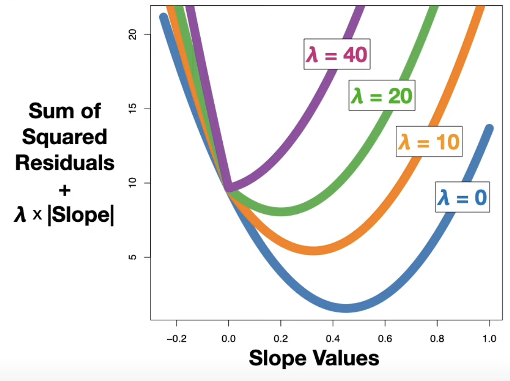
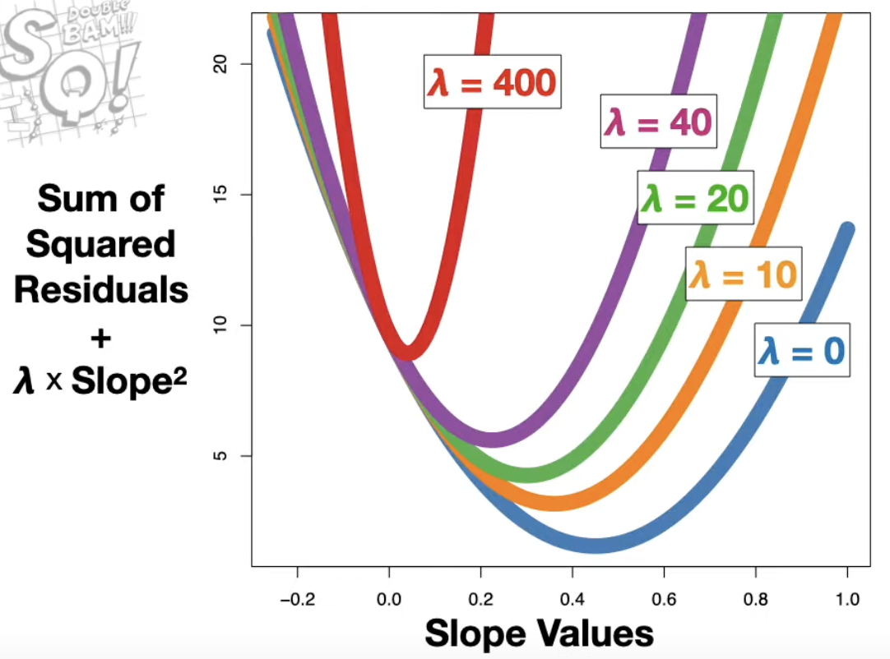

# Bike Sharing Demand

- Tutorial Link
    - 탐색적 데이터 분석 : https://www.kaggle.com/werooring/ch6-eda
    - 베이스라인 모델 : https://www.kaggle.com/werooring/ch6-baseline
    - 성능 개선 : https://www.kaggle.com/werooring/ch6-modeling

- My Work
    - EDA: https://www.kaggle.com/code/trispark/bike-sharing-demand-eda
    - Baseline: https://www.kaggle.com/code/trispark/bike-sharing-demand-baseline
    - Modeling: https://www.kaggle.com/code/trispark/bike-sharing-demand-modeling

- Contents
    - **Goal**
    - **Feature Engineering**
    - **Training Model**
        - **Linear Regression**
        - **Ridge Regression vs Lasso Regression**
        - **Random Forest Regression**
    - **Optimizing Hyper Parameters**
        - **Grid Search**
    - **Evaluation**
        - **RMSLE**
    

### Goal

- Combine historical usage patterns with weather data in order to forecast bike rental demand in the Capital Bikeshare program in Washington, D.C.

### Feature Engineering

1. Outlier removal; when the weather is bad → low consume rate 
2. Combine train & test data 
    1. Why? Train & test data should have **Consistent Scaling**
3. Add useful features 
    1. Ex) year, month, hour, weekday… → critically affect bike demands 
4. Drop unnecessary features 
5. After finishing adding & dropping features, can split train & test data again
    1. Drop target values
    2. Save target value somewhere for validation  

### Training Model

1. **Linear Regression** (baseline model)
    
    ```python
    from sklearn.linear_model import LinearRegression
    
    linear_reg_model = LinearRegression()
    
    linear_reg_model.fit(X_train, log_y) # train model (param0: training val, param1: target val)
    ```
    
2. **Ridge Regression vs Lasso Regression**
    - Reference link: https://www.youtube.com/watch?v=Xm2C_gTAl8c
    
    | Aspect | **Ridge Regression** | **Lasso Regression** |
    | --- | --- | --- |
    | **Regularization** | L2 regularization (sum of squared coefficients) | L1 regularization (sum of absolute coefficients) |
    | **Effect on Coefficients** | Shrinks coefficients but does not set them to zero | Can shrink coefficients to zero (performs feature selection) |
    | **Feature Selection** | Retains all features, but reduces their impact | Can eliminate irrelevant features by setting coefficients to zero |
    | **Use Case** | Useful when all features are likely to contribute to the model | Useful when only a few features are expected to be important |
    | **Bias-Variance Tradeoff** | Increases bias but decreases variance | Increases bias, decreases variance, and encourages sparsity |
    | **Model Complexity** | Results in a less sparse, more complex model | Produces a sparse model by removing irrelevant features |



Ridge Regression 



Lasso Regression 

1. **Random Forest Regression**
    - Reference link: https://www.youtube.com/watch?v=J4Wdy0Wc_xQ
    - Useful for regression tasks where the goal is to predict a continuous value
    - Process
        1. **Bootstrap Sampling**
            1. Random Forest uses a technique called **bagging** (Bootstrap Aggregating). It randomly samples subsets of the training data (with replacement) to train each decision tree. This means some data points may be used more than once while others are left out.
        2. **Multiple Decision Trees**
            1. The algorithm constructs multiple decision trees (hence the term “forest”) independently. Each tree is trained on a different subset of the data and attempts to learn the relationship between the features and the target variable.
        3. **Random Feature Selection**
            1. At each node in a decision tree, instead of considering all features to make the best split, Random Forest randomly selects a subset of features. This helps in reducing correlation between the trees and makes the model more robust.
        4. **Aggregation**
            1. In the regression case, once all the trees have been built, the predictions from each tree are **averaged** to get the final prediction for the target variable.
        

### Optimizing Hyper Parameters

- Grid Search
    - Systematically explore a specified set of hyperparameters for a model in order to identify the combination that results in the best performance. It is one of the most common methods used for hyperparameter tuning.
    - Process
        1. Define Hyperparameter Grid
        2. Perform Exhaustive Search
        3. Cross-validation 
            1. Cross-validation splits the training data into multiple subsets (or “folds”) and evaluates the model on each fold, which gives a more reliable estimate of model performance.
        4. Select Best Hyperparameters

### Evaluation

- RMSLE
    - Root Mean Squared Logarithmic Error
        
        $$\sqrt{\frac{1}{n} \sum_{i=1}^{n} \left( \log(p_i + 1) - \log(a_i + 1) \right)^2}$$
        
        ```python
        def rmsle(y_true, y_pred, convertExp=True):
            # convert exponent
            if convertExp:
                y_true = np.exp(y_true)
                y_pred = np.exp(y_pred)
                
            # transit pred to 0 after transition to log
            log_true = np.nan_to_num(np.log(y_true+1))
            log_pred = np.nan_to_num(np.log(y_pred+1))
            
            # calcuate RMSLE
            output = np.sqrt(np.mean((log_true - log_pred)**2))
            return output
        ```
        
    - Evaluate the performance of a regression model, especially when the target variable spans several orders of magnitude or when there are significant differences between large and small values in the dataset.
    - Use RMSLE when **relative errors** matter more than absolute errors.
    - Use it when the data contains large variability in magnitude or when the target values span several orders of magnitude (e.g., predicting very small and very large values within the same model)
- Why RMSLE?
    - **Handling Skewed Data**
        - Bike rental counts can vary widely, with some periods (e.g., rush hours or good weather days) having very high rental counts, while others (e.g., nighttime or bad weather days) may have much lower counts. This leads to a skewed distribution of the target variable, where most of the values are small, but there are occasional large values.
        - RMSLE applies a **logarithmic transformation**, which compresses the scale of larger numbers and makes the distribution more symmetric, helping the model handle data with wide variations in values.
    - **Penalizing Relative Errors**
        - RMSLE emphasizes **relative errors** rather than absolute errors. For instance, an error in predicting 10 bikes when the true count is 20 is treated similarly to an error in predicting 1000 bikes when the true count is 2000. This is important in bike-sharing systems because predicting small numbers of rentals (e.g., 20 instead of 10) should not be penalized as harshly as RMSE would, but predicting large rental counts (e.g., 1000 vs 2000) should still be considered a significant error.
        - This helps in providing a more balanced evaluation of the model’s performance across both low and high demand scenarios.
    - **Robustness to Outliers**
        - In bike-sharing data, outliers can occur due to unusual events like festivals, extreme weather conditions, or system outages. RMSLE reduces the impact of these outliers because the logarithmic transformation naturally dampens the effect of large values. As a result, the evaluation metric becomes more robust and less sensitive to rare extreme cases that could otherwise dominate the error calculation in a metric like RMSE.
    - **Avoiding Negative Predictions**
        - Since RMSLE compares the logarithms of predicted and actual values, the predictions need to be non-negative. This is well-suited for the bike-sharing problem, where the target variable (number of bike rentals) cannot be negative. RMSLE inherently enforces a restriction that negative predictions are heavily penalized, encouraging the model to predict realistic non-negative values.
    - **Focus on Forecasting Proportional Demand**
        - In bike-sharing systems, especially at the city scale, it’s more important to accurately forecast **proportional changes** in demand rather than absolute numbers. For example, predicting that demand will double or halve is more critical than predicting the exact count. RMSLE focuses on these proportional changes by using logarithms.
