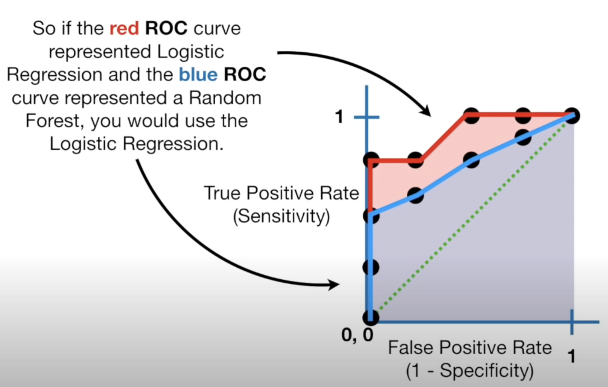

- Tutorial Link
    - 탐색적 데이터 분석 : https://www.kaggle.com/werooring/ch7-eda
    - 베이스라인 모델 : https://www.kaggle.com/werooring/ch7-baseline
    - 성능 개선 : https://www.kaggle.com/werooring/ch7-modeling

- My Work
    - EDA: https://www.kaggle.com/code/trispark/categorical-feature-encoding-challenge-eda
    - Baseline: https://www.kaggle.com/code/trispark/categorical-feature-encoding-challenge-baseline
    - Modeling: https://www.kaggle.com/code/trispark/categorical-feature-encoding-challenge-modeling

- Contents
    - **Goal**
    - **Feature Engineering**
        - **One Hot Encoding**
        - **Feature Encoding & Feature Scaling**
    - **Training Model**
        - **Logistic Regression**
    - **Evaluation**
        - **ROC & AUC**

### Goal

- Try different encoding schemes for different algorithms to compare how they perform
- Categorical Features
    - binary features
    - low- and high-cardinality nominal features
    - low- and high-cardinality ordinal features
    - (potentially) cyclical features

### Feature Engineering

- **One Hot Encoding**
    - Transform categorical data into a format that can be provided to algorithms that require numerical input
    - Categorical data, such as names of cities, colors, or other non-numerical variables, needs to be converted into a numerical form before being used in models -> use one hot encoding method
    
    ```python
    from sklearn.preprocessing import OneHotEncoder
    
    encoder = OneHotEncoder() # one-hot encoder
    all_data_encoded = encoder.fit_transform(all_data) # apply one-hot encoding
    ```
    
    - Limitation
        - **Inefficient for high-cardinality features**: Creates many columns, which can lead to high-dimensionality
        - **Not suitable for ordinal features**: One-hot encoding does not capture the ordinal nature (the inherent order) of the data. For example, it does not reflect that high school < college < postgraduate

- **Feature Encoding & Feature Scaling**
    - Binary feature encoding
        
        ```python
        all_data['bin_3'] = all_data['bin_3'].map({'F':0, 'T':1})
        all_data['bin_4'] = all_data['bin_4'].map({'N':0, 'Y':1})
        ```
        
    - Ordered feature encoding
        - Method 1: Manual mapping
        - Method 2: `OrdinalEncoder()`
        - Need scaling later → MinMaxScaler
    - Nominal feature encoding
        - Nominal: categorical variables that have discrete categories without any inherent order. ex) gender, country, or product categories
        - One Hot encoding → nominal features don’t have ordinal nature
    - Weather feature encoding
        - One Hot encoding
    - Feature Scaling
        - MinMaxScaler → scales Ordinal features btw 0 and 1
            - This is a feature scaling technique that **normalizes** the features so that their values lie between a specified minimum and maximum range (by default, between 0 and 1). This ensures that all features are on a similar scale, which is important for many machine learning algorithms that are sensitive to feature ranges (e.g., distance-based algorithms or gradient-based methods like logistic regression).
        - Combining Encoded and Scaled Features
            - Combine these scaled features with **encoded nominal** and **date-related features** into a single sparse matrix, which is memory-efficient for large datasets
        
        ```python
        all_data_sprs = sparse.hstack([sparse.csr_matrix(all_data),
                                       encoded_nom_matrix,
                                       encoded_date_matrix],
                                       format = 'csr')
        ```
        
        - all_data_sprs: final combined **sparse matrix**
            - **Scaled ordinal features** from the all_data DataFrame
            - **Encoded nominal features** from encoded_nom_matrix
            - **Encoded date-related features** from encoded_date_matrix.

### Training Model

- Logistic Regression
    - Reference link: https://www.youtube.com/watch?v=yIYKR4sgzI8
    
    | Aspect                         | **Linear Regression**                                    | **Logistic Regression**                                     |
|---------------------------------|----------------------------------------------------------|-------------------------------------------------------------|
| **Problem Type**                | Regression (predicting continuous values)                | Classification (predicting categorical outcomes)             |
| **Output**                      | Continuous value (e.g., 250,000 or 3.5)                  | Probability (between 0 and 1) or binary class (0 or 1)       |
| **Mathematical Model**          | Linear equation                                           | Logistic (Sigmoid) function                                  |
| **Formula**                     | $y = \beta_0 + \beta_1 X_1 + \beta_2 X_2 + \cdots + \beta_n X_n$ | $\log\left(\frac{p}{1 - p}\right) = \beta_0 + \beta_1 X_1 + \beta_2 X_2 + \cdots + \beta_n X_n$ |
| **Cost Function**               | Mean Squared Error (MSE)                                 | Log Loss (Cross-Entropy Loss)                                |
| **Goal**                        | Minimize the error in predicting continuous outcomes      | Maximize the likelihood of correctly classifying outcomes    |
| **Interpretation of Coefficients** | Change in target value for a unit change in feature    | Change in log-odds for a unit change in feature              |

### Evaluation

- **ROC & AUC**
    - Reference link: https://www.youtube.com/watch?v=4jRBRDbJemM
    - ROC: Receiver Operating Characteristic Curve
        - **Y-Axis (TPR or Recall)**: Represents the proportion of actual positives that are correctly predicted. (TPR: True Positive Rate)
            
            $ \text{TPR} = \frac{\text{True Positives (TP)}}{\text{True Positives (TP)} + \text{False Negatives (FN)}} $
            
        - **X-Axis (FPR)**: Represents the proportion of actual negatives that are incorrectly predicted as positives. (FPR: False Positive Rate)
        
        $ \text{FPR} = \frac{\text{False Positives (FP)}}{\text{False Positives (FP)} + \text{True Negatives (TN)}} $
        
        - **The curve**: The ROC curve shows the trade-off between the true positive rate and the false positive rate as you vary the classification threshold. The closer the curve is to the top-left corner, the better the model’s performance.
    - AUC: Area Under the ROC Curve
        
        
        
        Area under ROC curve
        
- Submissions are evaluated on [area under the ROC curve](http://en.wikipedia.org/wiki/Receiver_operating_characteristic) between the predicted probability and the observed target.
